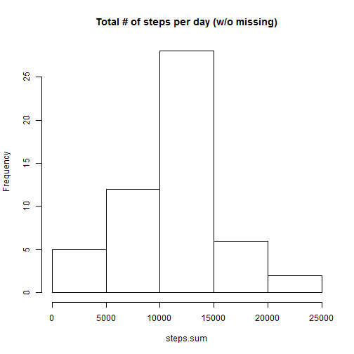
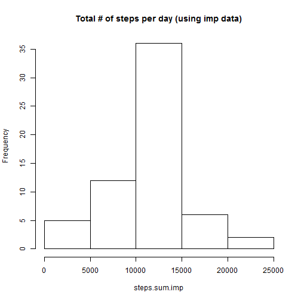

This is Peer Assessment 

## Loading and preprocessing the data


```r
setwd("C:/Users/msong/Documents/msong/Coursera/Reproducing_Research/data/")
getwd()
```

```
## [1] "C:/Users/msong/Documents/msong/Coursera/Reproducing_Research/data"
```

```r
dat=read.csv("activity.csv",header=T)
# use as.Date( ) to convert strings to dates 
dat$date <- as.Date(dat$date)

dat1=na.omit(dat)
```

## What is mean total number of steps taken per day?


```r
steps.sum=tapply(dat1$steps,dat1$date,sum)
hist(steps.sum, main='Total # of steps per day (w/o missing)')
```

 

```r
c(avg=mean(steps.sum),med=median(steps.sum))
```

```
##      avg      med 
## 10766.19 10765.00
```

## What is the average daily activity pattern?

```r
y1=tapply(dat1$steps,dat1$interval,mean)
length(y1)
```

```
## [1] 288
```

```r
x=names(y1)
plot(x,y1,type='l', main='Time series plot of 5-min intervals')
```

 

```r
which.max(y1)
```

```
## 835 
## 104
```

## Imputing missing values


```r
# 3 : Compute no. of missing values
dim(dat)[1] - dim(dat1)[1]
```

```
## [1] 2304
```

```r
#
# imputing missing values (using mean for 5-minute interval)
#
ndays=length(table(dat$date)); ndays
```

```
## [1] 61
```

```r
cnt=length(table(dat$interval))

y2=rep(y1,times=ndays)

dat2=dat
dat2$steps=ifelse(is.na(dat2$steps),y2,dat2$steps)
```


## Are there differences in activity patterns between weekdays and weekends?


```r
#### compute 
steps.sum.imp=tapply(dat2$steps,dat2$date,sum)
hist(steps.sum.imp,main='Total # of steps per day (using imp data)')
```

 

```r
c(avg=mean(steps.sum.imp),med=median(steps.sum.imp))
```

```
##      avg      med 
## 10766.19 10766.19
```

```r
#### Weekdays and weekends

dat3=dat2
dat3$date=as.Date(dat3$date)
dat3$wktype=ifelse(as.POSIXlt(dat3$date)$wday %in% c(0,6), 'weekend','weekday')

#head(dat3)
#tail(dat3)
table(dat3$wktype)
```

```
## 
## weekday weekend 
##   12960    4608
```

```r
# Panel Plot
y3 <- tapply(dat3$steps, list(dat3$interval,dat3$wktype), mean)
y4=data.frame(Interval=as.integer(row.names(y3)),y3)
library(stats)
y5=reshape(y4, varying=c("weekday","weekend"),
               v.names="steps", timevar="wktype",
               times=c("weekday","weekend"),
               new.row.names=1:576, 
             direction = "long")
library(lattice)
xyplot(steps ~Interval| wktype, data=y5, layout=c(1,2), type='l',
                 ylab='Number of Steps')
```

 


